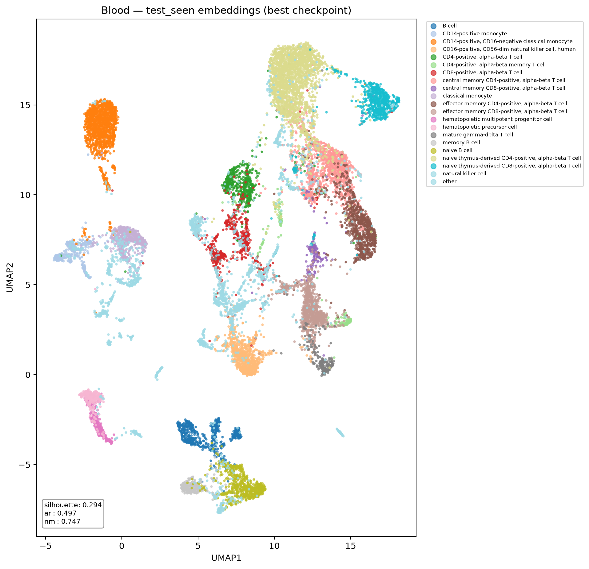
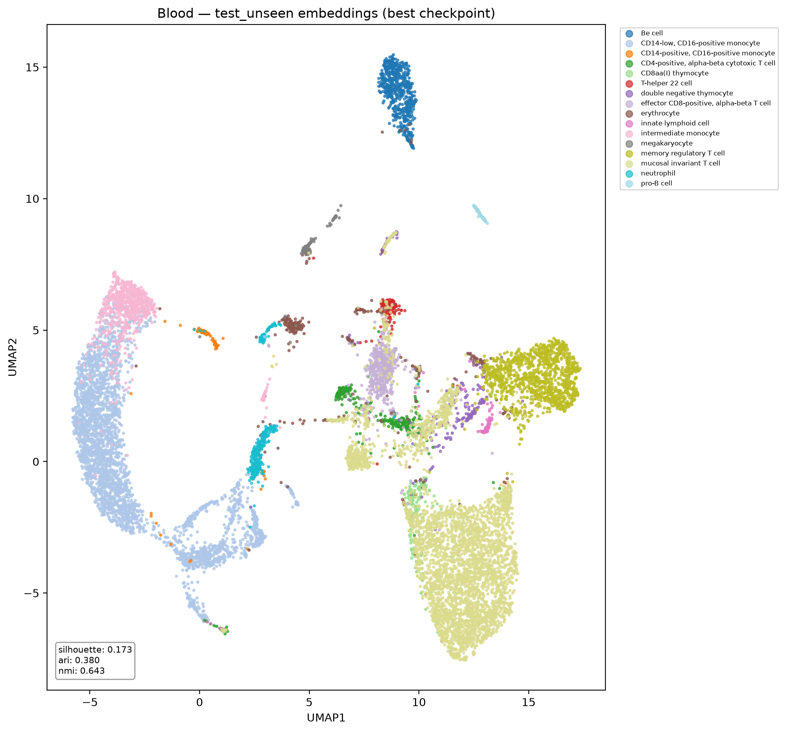
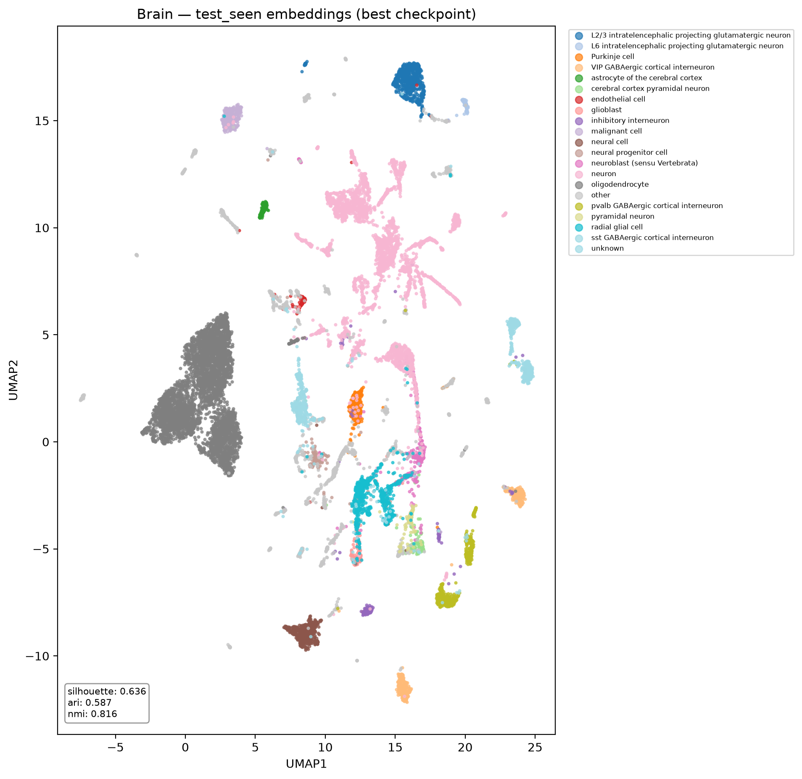
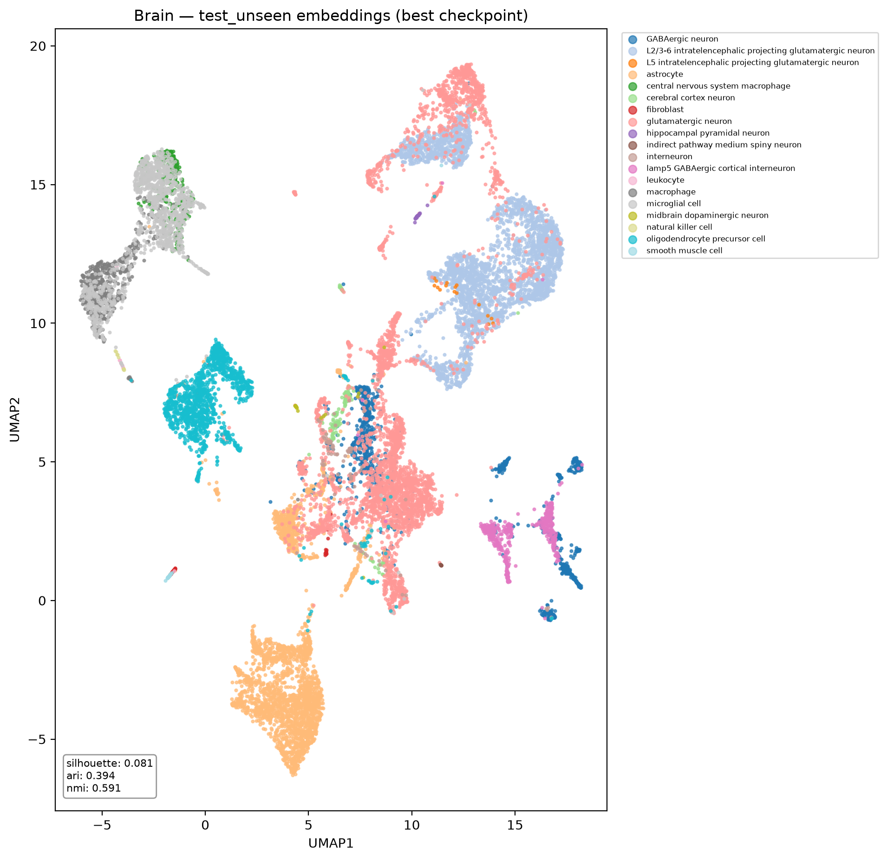

# scContrast

## What this project does

Single-cell RNA sequencing (scRNA-seq) measures, for each individual cell in a sample,
how active every gene is. A dataset is essentially a big table: rows are cells, columns
are genes, values are expression levels. The goal is to group cells by type (T-cell,
neuron, astrocyte, ...) using only this expression data — but raw expression vectors
are noisy and high-dimensional, so cell types don't separate cleanly in that raw space.

This project trains a neural network to transform each cell's expression vector into a
new, lower-dimensional "embedding" where cells of the same type end up close together
and cells of different types end up far apart — a much better space for clustering,
visualization, and downstream analysis than the raw data.

The specific technique is **supervised contrastive learning (SupCon)**: instead of just
telling the network "this cell is a T-cell," we show it two slightly corrupted versions
of the same cell (see [Augmentations](#augmentations) below) and train it to recognize
that both versions — and any other cell sharing the same label — belong together, while
pushing every other cell in the batch away. The network used to do this has two
identical, weight-sharing halves that each process one view and get compared against
each other — this "twin network" setup is what's meant by **siamese** in this context.

We also deliberately hide some cell types from the model entirely during training (see
[Seen vs. unseen splits](#seen-vs-unseen-splits)), so we can check whether the learned
embedding space generalizes to cell types it has never been told the name of.

## Where the data comes from

Data comes from the [CZ CELLxGENE Census](https://chanzuckerberg.github.io/cellxgene-census/),
a public repository of curated single-cell datasets. `scripts/download_census.py` pulls
a subset of cells for a given tissue (e.g. blood, brain), keeps only protein-coding
genes (the genes that actually produce proteins — the rest is mostly noise for this
purpose), and saves the result as an `.h5ad` file (the standard single-cell data format,
via the [AnnData](https://anndata.readthedocs.io/) library):

```
python scripts/download_census.py --tissue blood --n-cells 200000
python scripts/download_census.py --tissue brain --n-cells 200000
```

Two datasets have been downloaded so far, 200k cells each: `data/raw/blood_homo_sapiens.h5ad`
and `data/raw/brain_homo_sapiens.h5ad` (19,512 protein-coding genes). Raw and processed
data files are gitignored — they're large and easy to regenerate from the script, so
they don't belong in version control.

## Repository layout

- `data/` — raw and processed datasets. Gitignored.
- `scripts/` — `download_census.py`, the data acquisition step above.
- `notebooks/` — exploratory analysis (QC plots, a first UMAP look at the blood data)
  before any modeling starts.
- `experiments/` — one self-contained folder per experiment. Each has its own data
  loading, model, loss, training loop, and plotting code, so experiments can diverge
  (different preprocessing, different tissue) without one breaking another. Run outputs
  (checkpoints, logs, figures) are gitignored; the code that produced them is tracked.

## How a training run works, step by step

Each experiment (`experiments/contrastive_supcon` for blood,
`experiments/contrastive_supcon_brain` for brain) runs the same pipeline:

### 1. Preprocess

Raw counts aren't directly comparable between cells — a cell that was sequenced more
deeply just has bigger numbers across the board, not "more expression." Each
experiment's `dataset.py` defines its own preprocessing to correct for this:

- **Blood** (`contrastive_supcon`): normalize each cell to counts-per-million (CPM) so
  sequencing depth doesn't bias the comparison, log-transform to tame extreme values,
  keep only the 2,000 most variable genes (the ones that actually differ between cell
  types — the rest is mostly flat, uninformative signal), then z-score scale.
- **Brain** (`contrastive_supcon_brain`): CPM normalization only, keeping the full set
  of ~19.5k protein-coding genes — no log transform, no gene filtering, no scaling. A
  deliberately simpler pipeline than blood's, to see how much (if any) of that extra
  preprocessing was actually necessary.

The result is cached to `data/processed/` so this only runs once per configuration.

### 2. Split cell types into seen vs. unseen

This is the core experimental design choice, worth explaining in full. Cell types are
split two ways:

- **Unseen types** (20% of types by default) are removed from training entirely — the
  model never sees a single labeled example of them. They only appear later, at
  evaluation time, in a `test_unseen` set.
- **Seen types** (the remaining 80%) are split, per cell type, into `train` / `val` /
  `test_seen` (70% / 10% / 20%).

Evaluating on `test_seen` answers "did the model learn to separate the types it was
trained on?" Evaluating on `test_unseen` answers the more interesting question: "does
the geometry the model learned transfer to types it never saw a label for?" A model that
only memorizes its training labels will do fine on `test_seen` and fall apart on
`test_unseen`; a model that learned something general about what makes cell types
different should hold up reasonably well on both.

### 3. Train

- **Augmentations** (`augmentations.py`): for every cell in a batch, two corrupted
  copies are generated — random genes zeroed out, random per-cell rescaling, and
  Gaussian noise added. These two views are the positive pair the network learns to
  pull together.
- **Model** (`model.py`): a shared-weight MLP encoder turns each view into a 128-dim
  embedding; a small projection head further maps that down to 64 dims, purely for
  computing the loss (standard practice — keeps the loss geometry decoupled from the
  embedding actually used downstream).
- **Loss** (`losses.py`): Supervised Contrastive Loss (Khosla et al., 2020). Within a
  batch, all views of all cells sharing a label are pulled together, everything else is
  pushed apart — a generalization of the more common "only my own two augmented views
  are positives" contrastive setup, made possible by having the true label available.
- **Metrics** (`metrics.py`), computed periodically on val/test: silhouette score
  (how well-separated the true classes are in embedding space) and ARI/NMI (how well an
  unsupervised KMeans clustering of the embeddings agrees with the true labels).
- **Logging**: everything is written to TensorBoard — loss curves, the metrics above per
  split, UMAP visualizations of the embedding space per split/epoch, weight/gradient
  histograms, class balance per split, and a histogram comparing cosine similarity for
  same-class vs. different-class pairs (the clearest single read on whether the loss is
  doing its job).

Run it:

```
python experiments/contrastive_supcon/main.py --run-name <name> --epochs 50
python experiments/contrastive_supcon_brain/main.py --run-name <name> --epochs 50
```

Add `--debug` to subsample every split down to a few thousand cells first — useful for
catching bugs in seconds instead of minutes before committing to a full run.

## Running your own experiment (e.g. a new tissue)

Everything above describes what already exists. This section is for actually using the
repo to try a new tissue or a new preprocessing/training configuration.

### 1. Set up the environment

```
conda env create -f environment.yml
conda activate sccontrast
```

### 2. Download a tissue

`--tissue` must match a `tissue_general` value in the Census (e.g. `blood`, `brain`,
`lung`, `heart`, `kidney`, ...). Check what's available and how many cells exist for a
tissue before committing to a large download by first running with a small `--n-cells`
and reading the printed cell-type breakdown, or by browsing the
[Census tissue list](https://cellxgene.cziscience.com/) directly.

```
python scripts/download_census.py --tissue lung --n-cells 200000
```

This writes `data/raw/lung_homo_sapiens.h5ad`. First run is slower — it resolves gene
biotypes via mygene.info to filter down to protein-coding genes, then caches that lookup
to `data/processed/gene_biotypes_homo_sapiens.csv` for every subsequent download. Expect
the download itself to take a while for large `--n-cells`; it's pulling real expression
matrices over the network, not just metadata.

### 3. Create a new experiment folder

Each experiment is self-contained on purpose, so the easiest way to start a new one is
to copy an existing folder and adjust it rather than trying to parametrize a single
shared codebase over every possible tissue/preprocessing combination:

```
cp -r experiments/contrastive_supcon_brain experiments/contrastive_supcon_lung
```

Then, inside the new folder:

- `dataset.py`: point `RAW_DIR` default filename at your new `.h5ad`, and decide on
  preprocessing in `preprocess()` — CPM-only (brain's approach: keep all genes, simplest)
  vs. CPM + log1p + HVG + scaling (blood's approach: fewer, more standardized features).
  There's no universally correct choice; it's worth trying both for a new tissue and
  comparing, the way this repo currently does across the two existing experiments.
- `main.py`: update the `--raw-path` default and the module docstring, and reconsider
  hyperparameters if the new tissue's cell count or gene dimensionality differs
  substantially from blood/brain (e.g. `--batch-size`, `--hidden-dims`, `--embed-dim`).

### 4. Smoke-test with `--debug` before committing to a full run

```
python experiments/contrastive_supcon_lung/main.py --run-name debug --debug --epochs 3
```

This subsamples every split to `--debug-n-cells` (default 4,000) so you catch shape
mismatches, missing columns, or config typos in seconds rather than after a
multi-hour run. Only move to a full run once this passes cleanly.

### 5. Run the full training

```
python experiments/contrastive_supcon_lung/main.py --run-name baseline --epochs 50
```

Key flags worth knowing (see `main.py`'s `parse_args()` for the full list):

- `--epochs`, `--batch-size`, `--lr` — standard training knobs.
- `--unseen-frac` — fraction of cell types held out entirely (default 0.2); raise it for
  a harder generalization test, lower it if a tissue has too few cell types to spare.
- `--min-cells-per-type` — cell types with fewer cells than this are dropped rather than
  split (default 50); raise it for noisy/rare-type-heavy tissues.
- `--eval-every` — how often (in epochs) to compute embedding metrics and log UMAP
  figures; these are the slow steps, so infrequent eval speeds up long runs.
- `--force-preprocess` / `--force-splits` — bypass the cache and regenerate, e.g. after
  editing `preprocess()` or `SplitConfig`.

Training runs on GPU automatically if `torch.cuda.is_available()`, otherwise falls back
to CPU (as brain's `cpm_baseline` run did — about 65s/epoch on 200k cells with 19.5k
genes on CPU; expect roughly proportional scaling with cell count and gene count).

### 6. Watch progress in TensorBoard

```
tensorboard --logdir experiments/contrastive_supcon_lung/runs
```

This surfaces everything logged during training: loss curves, per-split silhouette/ARI/
NMI over epochs, UMAP scatter plots per split/epoch, weight/gradient histograms, class
balance, and the same-class vs. different-class cosine similarity histograms.

### 7. Find your results

After a run finishes, `experiments/contrastive_supcon_lung/runs/<run-name>/` contains:

- `best_model.pt` — the checkpoint with the highest validation silhouette seen during
  training (what you'd load for downstream use).
- `final_model.pt` — the weights at the last epoch.
- `config.json` — every argument the run was launched with, for reproducibility.
- `test_metrics.json` — final silhouette/ARI/NMI on `test_seen` and `test_unseen`.
- `tensorboard/` — the full TensorBoard log directory.

## Results so far

Each run tracks two kinds of "best": the **best checkpoint** (`best_model.pt`, the epoch
with the highest validation silhouette during training — this is normally the one you'd
actually use downstream) and the **final-epoch test metrics** (`final_model.pt`,
evaluated once on held-out `test_seen` / `test_unseen` after training ends). Both are
reported below.

**Blood** (`contrastive_supcon`, run `supcon_baseline`, 60 epochs, HVG-2000 preprocessing):

Best validation checkpoint (reached at the final epoch, 60/60):

| split | silhouette | ARI   | NMI   |
|-------|-----------:|------:|------:|
| val   | 0.296      | 0.504 | 0.745 |

Final-epoch test evaluation:

| split       | silhouette | ARI   | NMI   |
|-------------|-----------:|------:|------:|
| test_seen   | 0.294      | 0.497 | 0.747 |
| test_unseen | 0.173      | 0.380 | 0.643 |

As expected, performance drops from seen to unseen types, but the drop isn't
catastrophic — the model retains a meaningful chunk of its clustering quality on cell
types it never saw a label for.

<p align="center">
  
  
</p>

**Brain** (`contrastive_supcon_brain`, run `cpm_baseline`, 50 epochs, CPM-only
preprocessing, all ~19.5k protein-coding genes, trained on CPU — the machine's GPU is
currently unavailable at the driver level, unrelated to this project):

Best validation checkpoint (reached at the final epoch — validation silhouette climbed
monotonically for the last 25 epochs and hadn't plateaued yet, so more epochs would
likely help further):

| split | silhouette | ARI   | NMI   |
|-------|-----------:|------:|------:|
| val   | 0.639      | 0.589 | 0.828 |

Final-epoch test evaluation:

| split       | silhouette | ARI   | NMI   |
|-------------|-----------:|------:|------:|
| test_seen   | 0.636      | 0.587 | 0.816 |
| test_unseen | 0.081      | 0.394 | 0.591 |

<p align="center">
  
  
</p>

On `test_seen`, brain clearly outperforms blood's best silhouette (0.636 vs. 0.294) —
expected, since brain cell types (neurons, astrocytes, oligodendrocytes, microglia, ...)
are more transcriptionally distinct from each other than most blood cell types, so they
were picked partly as this kind of "should be easy" reference point.

The `test_unseen` picture is more interesting: silhouette collapses to 0.081 (worse than
blood's 0.173), even though ARI/NMI hold up reasonably (0.394 / 0.591). That combination
— clustering agreement still decent, but the embedding geometry itself much less
separated by the raw silhouette measure — is consistent with dropping HVG selection and
scaling: with all ~19.5k genes and no per-gene scaling, a handful of high-magnitude genes
can dominate the distance geometry the augmentations and loss operate on, so unseen
types tend to end up compressed into less cleanly separated regions even when a
downstream clustering can still mostly untangle them. Worth testing whether reintroducing
per-gene scaling (without HVG filtering, to keep the full gene set) recovers unseen-type
separation without sacrificing the test_seen gains, and whether training brain past 50
epochs pushes val silhouette meaningfully higher given it hadn't plateaued yet.

## Getting set up

```
conda env create -f environment.yml
conda activate sccontrast
```

Uses PyTorch 2.5.1 + CUDA 12.1, and falls back to CPU automatically if no GPU is
available.
